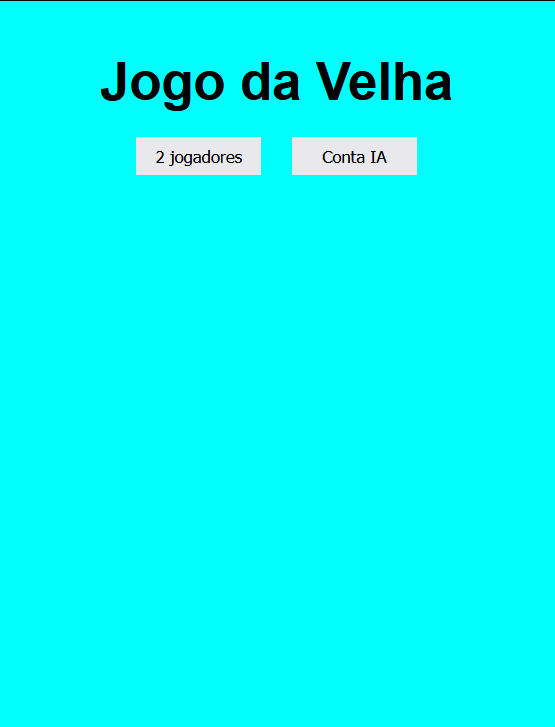
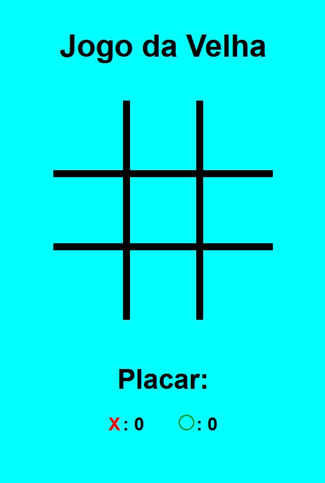

# Jogo da Velha

Desenvolvido por:
 Mislene Moura - [Linkedin](https://www.linkedin.com/in/mislene-silva-moura-1211531b4//) |
   [Github](https://github.com/MisleneSM)

   
***

## Índice

* [1. Resumo do projeto](#1-resumo-do-projeto)
* [2. Objetivos de aprendizagem](#2-objetivos-de-aprendizagem)
* [3. Tecnologias Utilizadas](#3-tecnologias-utilizadas)

***

## 1. Resumo do Projeto🤩

Desenvolvido um mini projeto de jogo da velha para melhorar os meus conhecimentos na linguagem Java Script através do curso realizado do canal [Hora de Codar](https://horadecodar.com.br/).

Se você é amante de jogos e de competição, e deseja se divertir com seus amigos ou encarar uma partida com a nossa IA basta clicar [aqui](https://jogo-da-velha-rose.vercel.app/)

## 2. Objetivos de aprendizagem✅

- HTML
- CSS
- Java Script

#### Resultado Final do Projeto

 

## 3. Tecnologias Utilizadas✅ 

      
